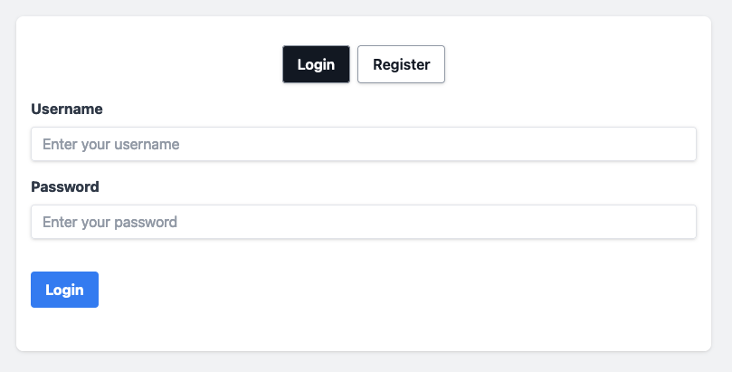
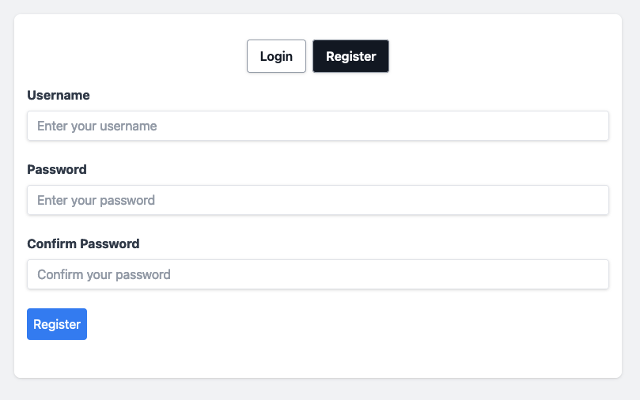
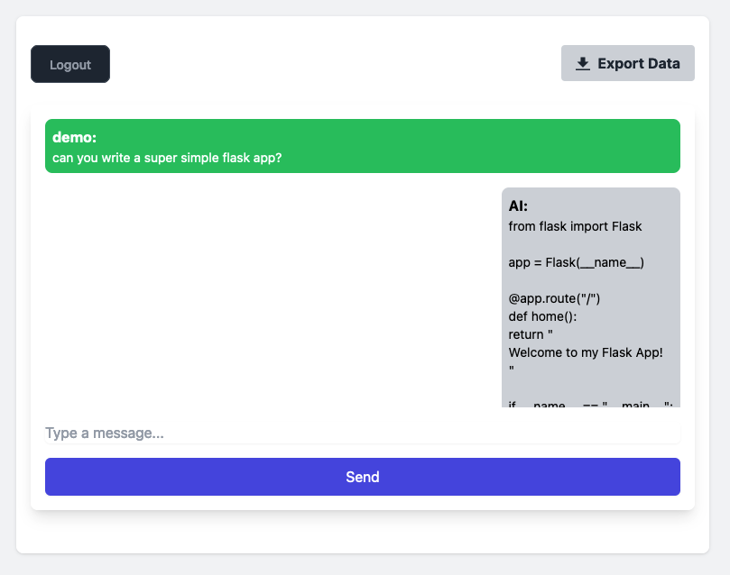

# chatgpt-flask-react-toyapp

This is a really simple toy app using Flask (plus MongoDB) and React to interact with OpenAI.  
This project was created mostly for myself to keep learning React.js but surely will serve as a good "template" for someone else.


## Usage

This proof-of-concept app is pretty much ready to use and play _but_ you'll still need an [OpenAI API Key](https://platform.openai.com/account/api-keys) and complete Line #12 (`CHATGPT_API_KEY`) in [docker-compose.yml](docker-compose.yml):  

```yaml
version: '3'
services:
  ...
  flask:
    ...
    environment:
      - CHATGPT_API_KEY=sk-...
...
```

Once that's completed, simply build and _up_ the Docker container.

```bash
docker-compose up --build
```

This docker-compose contains 3 services:

* `mongo`, as the DB. It'll store the _conversations_ and user data.
* `flask`, as the BE. It'll provide a series of endpoints (see below).
* `react`, as the FE. It'll provide a UI to interact with the BE.

## Frontend

The FE is really simple:

* A screen that allows to either Login or Register
* A "chat" interface to interact with ChatGPT. Also contains an Export button.

### Login



### Register



### Chat



## Backend - Endpoints

### `/register/...`: `POST`

The `register` endpoint provides two "sub endpoints":

* `/register/check`: `POST`, This endpoint simply verifies if a username is available. Returns 200 or 404 status code.
* `/register/create`: `POST`, This will finally create the user (returning 201 status code), but will return 409 status code if the user already exists.

### `/login`: `POST`

This endpoint expects an `username` and `password`, and will return a Token or a 401 status code in case of failure.

### `/chat`: `POST`

This endpoint expects a `message` and a JWT for AuthZ. This `message` will be sent to OpenAI API and return the response. The whole _conversation_ will be stored.

### `/export/<username>`: `GET`

This endpoint only requires a JWT for AuthZ. Returns a JSON file with the whole _conversation_.

## LICENSE

See [LICENSE](LICENSE)